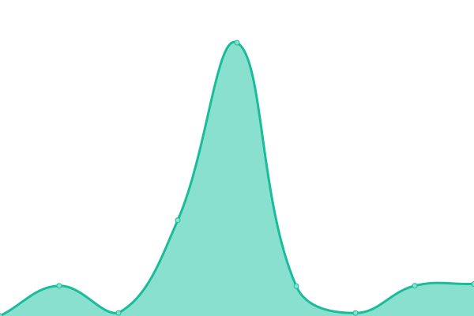
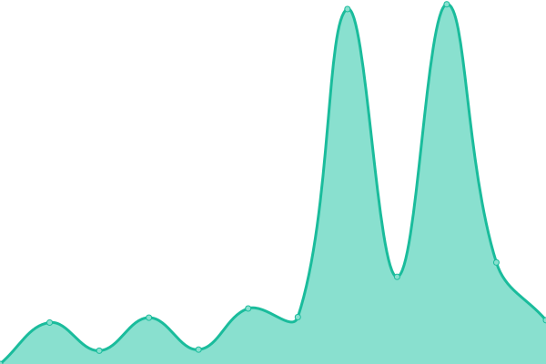
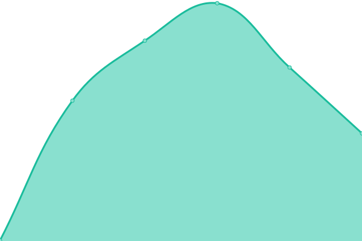

# [📈 Live Status](https://status.patternsdigital.com): <!--live status--> **🟧 Partial outage**

This repository contains the open-source uptime monitor and status page for [Patterns Digital](https://www.patternsdigital.com), powered by [Upptime](https://github.com/upptime/upptime).

With [Upptime](https://upptime.js.org), you can get your own unlimited and free uptime monitor and status page, powered entirely by a GitHub repository. We use [Issues](https://github.com/patternsdigital/uptime-monitor/issues) as incident reports, [Actions](https://github.com/patternsdigital/uptime-monitor/actions) as uptime monitors, and [Pages](https://status.patternsdigital.com) for the status page.

<!--start: status pages-->
<!-- This summary is generated by Upptime (https://github.com/upptime/upptime) -->
<!-- Do not edit this manually, your changes will be overwritten -->
<!-- prettier-ignore -->
| URL | Status | History | Response Time | Uptime |
| --- | ------ | ------- | ------------- | ------ |
|  [Patterns Digital](https://patternsdigital.com) | 🟩 Up | [patterns-digital.yml](https://github.com/patternsdigital/uptime-monitor/commits/HEAD/history/patterns-digital.yml) | 

 3154ms
     
 | 

<a href="https://status.patternsdigital.com/history/patterns-digital">94.35%</a>
    

|  [Field for Humanity](https://fieldforhumanity.org) | 🟩 Up | [field-for-humanity.yml](https://github.com/patternsdigital/uptime-monitor/commits/HEAD/history/field-for-humanity.yml) | 

 564ms
     
 | 

<a href="https://status.patternsdigital.com/history/field-for-humanity">98.55%</a>
    

|  [Deomusisi](https://deomusisi.com) | 🟩 Up | [deomusisi.yml](https://github.com/patternsdigital/uptime-monitor/commits/HEAD/history/deomusisi.yml) | 

 351ms
     
 | 

<a href="https://status.patternsdigital.com/history/deomusisi">98.55%</a>
    

|  [Oxycare Uganda](https://oxycareug.org) | 🟥 Down | [oxycare-uganda.yml](https://github.com/patternsdigital/uptime-monitor/commits/HEAD/history/oxycare-uganda.yml) | 

 111ms
     
 | 

<a href="https://status.patternsdigital.com/history/oxycare-uganda">0.00%</a>
    

<!--end: status pages-->

[**Visit our status website →**](https://status.patternsdigital.com)

## 📄 License

- Powered by: [Upptime](https://github.com/upptime/upptime)
- Code: [MIT](./LICENSE) © [Anand Chowdhary](https://anandchowdhary.com), supported by [Pabio](https://pabio.com)
- Data in the `./history` directory: [Open Database License](https://opendatacommons.org/licenses/odbl/1-0/)
